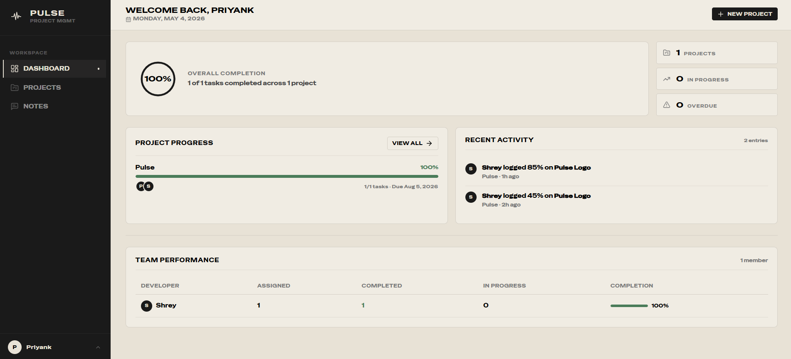
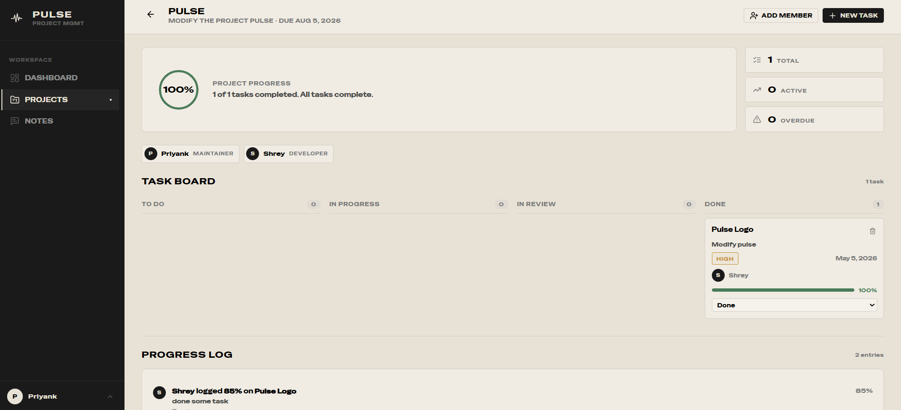
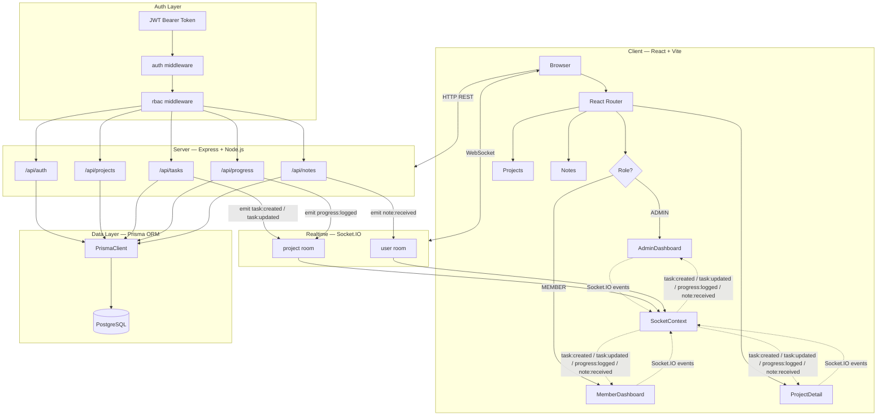
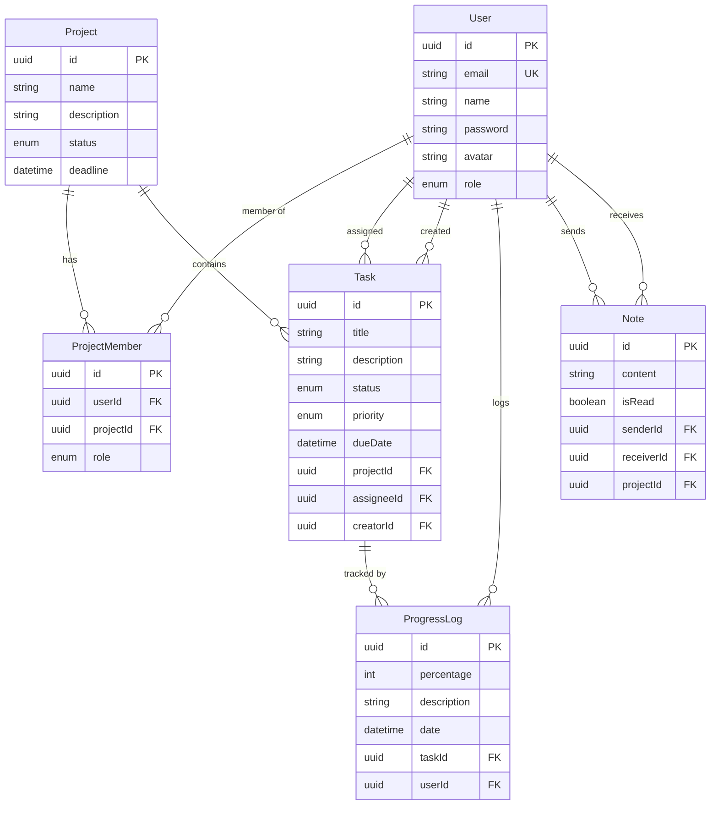

<table width="100%" border="0" cellspacing="0" cellpadding="0">
  <tr>
    <td>
      
    </td>
    <td width="110" align="right" valign="middle" style="padding-left:16px;">
      
    </td>
  </tr>
</table>

<p align="center">
  <a href="https://github.com/Priyank911/Pulse/releases"></a>
  
  
  
  
  
  
</p>

Pulse is a project management and progress tracking platform for teams that need clear task ownership, live visibility, and structured daily accountability. Admins get a complete view of every project, task, and developer. Team members get a focused workspace to track their own assignments and log daily progress. Both views update in real time through Socket.IO without a page reload.

---

## Overview

Teams consistently fail to answer three questions: what is being built, who owns it, and how far along it is. Pulse is structured around those three questions. An admin creates projects, assembles a team, and breaks delivery into tasks with priorities, due dates, and assignees. Each task moves through a four-stage lifecycle — Todo, In Progress, In Review, Done. Developers log daily progress against their tasks with a percentage and a written note. Those logs automatically advance task status and feed the analytics visible across every dashboard. The result is a workspace where delivery accountability is embedded in the workflow rather than managed through separate status meetings or external spreadsheets.

---

## Dashboard

<p align="center">
  
</p>

The admin dashboard renders a live completion ring showing the overall task completion rate, four stat cards tracking total projects, total tasks, in-progress tasks, and overdue items, a per-project breakdown with member count and aggregated progress, a developer workload table with assigned, completed, and in-progress counts per person, and a chronological feed of recent progress logs across all projects. Every widget re-fetches automatically when a progress entry or task update is broadcast over Socket.IO.

## Project Workspace

<p align="center">
  
</p>

The project detail view renders a Kanban board across all four task statuses alongside a team member roster and project metadata. Tasks can be filtered at query level by status, priority, and assignee. Each task card shows its priority badge, due date, assignee avatar, and latest logged progress percentage. Members open a task to submit a progress update inline without leaving the board.

---

## Features

**Role-based access control.** Two global roles — Admin and Member — enforced at the route level through JWT middleware before any handler runs. Projects carry an additional Maintainer and Developer role layer enforced through a separate `requireProjectRole` middleware that validates membership against the database on each request.

**Project lifecycle management.** Admins create projects with a name, description, deadline, and initial member set. Projects carry Active, Completed, or Archived status. The project list endpoint computes a real-time progress percentage per project by averaging the latest progress log value across all tasks, treating Done tasks as 100% and tasks with no logs as 0%.

**Kanban task board.** Tasks support a four-stage status workflow with four priority levels — Low, Medium, High, Urgent. Each task carries an optional due date, a dedicated assignee, and a creator. The board endpoint returns results sorted by priority descending then creation date descending, and accepts query-level filters for status, priority, and assignee.

**Progress logging with automatic status advancement.** Developers submit a daily log against any assigned task with a percentage from 0 to 100 and a written description. Before writing the log, the server checks the task's current status and auto-transitions it: any percentage above zero on a Todo task moves it to In Progress; a percentage of 100 moves it to Done. The updated status is included in the Socket.IO event payload emitted to the project room immediately after the write, so connected clients always receive the correct post-update state.

**Real-time updates.** Clients join a project room on navigation and a user room on login. Task creation and update events, progress log events, and note delivery events are broadcast to the appropriate rooms. Admin dashboards subscribe to task and progress events and re-fetch analytics on each receipt without polling.

**Internal notes.** Users send direct notes to any other user on the platform, with an optional project context attached. Notes are pushed to the recipient's user room via Socket.IO on send and marked as read through a dedicated endpoint. The notes view renders sent and received messages together in reverse chronological order.

**Tailored dashboards per role.** Admins see aggregate analytics, per-project health, developer workload, and a live activity feed. Members see their own task board grouped by status, a personal completion rate, an overdue counter, a progress log form for active tasks, and a record of all logs submitted today.

---

## Architecture
 


**Request path.** Every HTTP request passes through the auth middleware, which validates the JWT and attaches the resolved user to the request object. Routes requiring project membership run `requireProjectRole` immediately after, querying the `project_members` table before the handler executes. The handler calls Prisma, which translates the operation into a PostgreSQL query and returns typed result objects.

**Realtime path.** Route handlers receive the Socket.IO server instance through `req.io`, injected by middleware at startup. On task creation, task update, or progress log, the handler emits a named event to the relevant project room. On note send, it emits to the recipient's user room. Subscribed clients trigger a data re-fetch on receipt, keeping all views live without polling.

**Progress auto-advancement.** On each progress log submission, the server reads the task's current status before writing. If the incoming percentage is above zero and the task is in Todo, a second Prisma update moves it to In Progress. If the percentage is 100, it moves to Done. This runs within the same request cycle before the Socket.IO emit, so the event payload always carries the final correct task status.

---

## Data Model



---

## Tech Stack

| Layer | Technology | Version |
|---|---|---|
| Frontend | React | 18.3 |
| Bundler | Vite | 5.4 |
| Routing | React Router | v6 |
| Charts | Recharts | 2.13 |
| Icons | Lucide React | 0.454 |
| Toasts | React Hot Toast | 2.4 |
| HTTP Client | Axios | 1.7 |
| Realtime Client | Socket.IO Client | 4.8 |
| Backend | Node.js + Express | 4.21 |
| ORM | Prisma | 5.22 |
| Database | PostgreSQL | — |
| Auth | jsonwebtoken + bcryptjs | 9.0 / 2.4 |
| Validation | express-validator | 7.2 |
| Realtime Server | Socket.IO | 4.8 |
| Deployment | Railway | — |

---

## Project Structure

```text
Pulse/
├── client/
│   ├── public/
│   │   ├── pulse-banner.png
│   │   ├── pulse-logo.svg
│   │   ├── pulse-logo-light.svg
│   │   └── favicon.svg
│   └── src/
│       ├── components/Layout/
│       │   ├── AppLayout.jsx
│       │   └── Sidebar.jsx
│       ├── context/
│       │   ├── AuthContext.jsx
│       │   └── SocketContext.jsx
│       ├── pages/
│       │   ├── AdminDashboard.jsx
│       │   ├── MemberDashboard.jsx
│       │   ├── Projects.jsx
│       │   ├── ProjectDetail.jsx
│       │   ├── Notes.jsx
│       │   ├── Login.jsx
│       │   └── Register.jsx
│       ├── utils/
│       │   ├── api.js
│       │   └── helpers.js
│       ├── App.jsx
│       ├── main.jsx
│       └── index.css
├── server/
│   ├── prisma/
│   │   ├── schema.prisma
│   │   ├── seed.js
│   │   └── clear.js
│   └── src/
│       ├── middleware/
│       │   ├── auth.js
│       │   ├── rbac.js
│       │   └── validate.js
│       ├── routes/
│       │   ├── auth.js
│       │   ├── projects.js
│       │   ├── tasks.js
│       │   ├── progress.js
│       │   └── notes.js
│       ├── socket.js
│       └── index.js
├── .env.example
├── package.json
├── Procfile
└── railway.json
```

---

## Getting Started

### Prerequisites

Node.js 18 or later and a PostgreSQL database — local or hosted.

### Clone and Install

```bash
git clone https://github.com/Priyank911/Pulse.git
cd Pulse
npm install
```

The root `package.json` installs client and server dependencies in one command.

### Environment

```bash
cp .env.example .env
```

| Variable | Description |
|---|---|
| `DATABASE_URL` | PostgreSQL connection string passed directly to Prisma |
| `JWT_SECRET` | Secret used to sign and verify all tokens |
| `PORT` | Port the Express server listens on — defaults to `4000` |
| `NODE_ENV` | Set to `development` locally, `production` on deploy |
| `CLIENT_URL` | Origin used for CORS allowlisting — `http://localhost:5173` locally |

### Database

```bash
cd server
npx prisma migrate deploy
npx prisma db seed
```

The seed script creates two projects, six tasks across all statuses, four progress logs, and three demo accounts ready to use immediately.

### Development

```bash
npm run dev
```

Starts the Vite dev server on port 5173 and the Express server on port 4000 concurrently from the repository root.

### Production

```bash
npm run build
npm run start
```

`build` compiles the React client. `start` runs `npx prisma migrate deploy` then launches the Express server, which serves the compiled client as static files.

---

## API Reference

### Auth

| Method | Endpoint | Auth | Description |
|---|---|---|---|
| `POST` | `/api/auth/register` | None | Create a new account |
| `POST` | `/api/auth/login` | None | Authenticate and receive a JWT |
| `GET` | `/api/auth/me` | Required | Return the caller's profile |
| `GET` | `/api/auth/users` | Required | List all users |

### Projects

| Method | Endpoint | Auth | Description |
|---|---|---|---|
| `GET` | `/api/projects` | Required | List projects where the caller is a member |
| `POST` | `/api/projects` | Admin | Create a project |
| `GET` | `/api/projects/:id` | Member | Fetch project with members, tasks, and progress |
| `PUT` | `/api/projects/:id` | Maintainer | Update name, description, status, or deadline |
| `POST` | `/api/projects/:id/members` | Maintainer | Add a member to the project |

### Tasks

| Method | Endpoint | Auth | Description |
|---|---|---|---|
| `GET` | `/api/tasks/project/:projectId` | Member | List tasks with optional status, priority, assignee filters |
| `GET` | `/api/tasks/my` | Required | List tasks assigned to the caller |
| `POST` | `/api/tasks` | Member | Create a task |
| `PUT` | `/api/tasks/:id` | Member | Update task fields |

### Progress

| Method | Endpoint | Auth | Description |
|---|---|---|---|
| `POST` | `/api/progress` | Required | Submit a progress log against a task |
| `GET` | `/api/progress/dashboard` | Required | Aggregate analytics for admin view |
| `GET` | `/api/progress/developer` | Required | Personal task and log data for member view |
| `GET` | `/api/progress/task/:taskId` | Required | Full log history for a task |

### Notes

| Method | Endpoint | Auth | Description |
|---|---|---|---|
| `GET` | `/api/notes` | Required | Fetch all sent and received notes |
| `POST` | `/api/notes` | Required | Send a note to a user |
| `PUT` | `/api/notes/:id/read` | Required | Mark a note as read |

---

## Socket.IO Events

| Event | Direction | Room | Payload |
|---|---|---|---|
| `join:project` | Client → Server | — | `projectId` |
| `leave:project` | Client → Server | — | `projectId` |
| `join:user` | Client → Server | — | `userId` |
| `task:created` | Server → Client | `project:{id}` | Full task object |
| `task:updated` | Server → Client | `project:{id}` | Full task object |
| `progress:logged` | Server → Client | `project:{id}` | Log object + `taskStatus` |
| `note:received` | Server → Client | `user:{id}` | Full note object |

---

## Demo Accounts

Seeded automatically on `npx prisma db seed`:

| Role | Email | Password |
|---|---|---|
| Admin | admin@pulse.app | admin123 |
| Developer | sarah@pulse.app | dev123 |
| Developer | james@pulse.app | dev123 |

---

## Deployment

Pulse ships with a `Procfile` and `railway.json` configured for Railway. Connect a PostgreSQL plugin in your Railway service — Railway injects `DATABASE_URL` automatically. Set the remaining environment variables, deploy, and the server handles migrations and static file serving from a single service.

---

## Contributing

Open an issue before submitting a pull request for anything beyond a small bug fix. Clear scope and approach discussion upfront keeps contributions on track.

---

<p align="center">
  
  <br/>
  <sub>Built by <a href="https://github.com/Priyank911">Priyank911</a></sub>
</p>